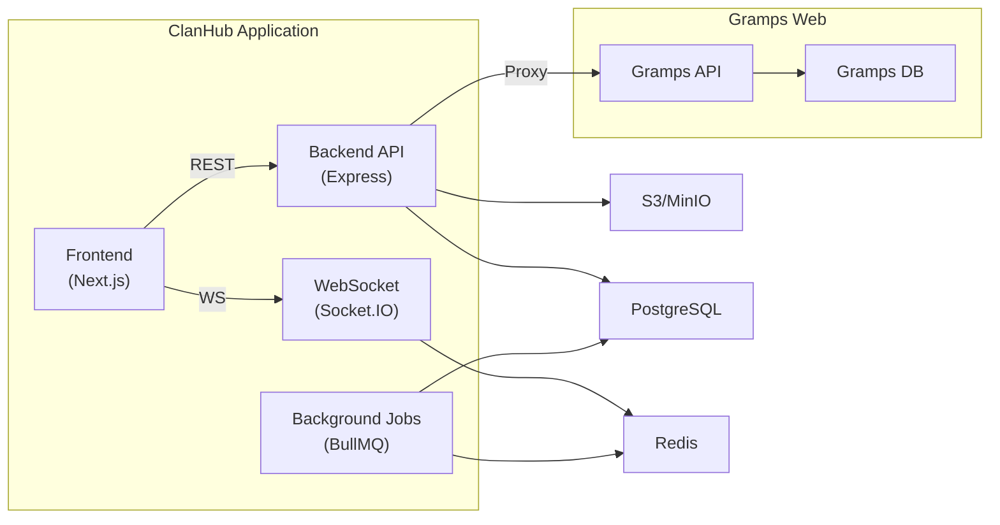

# PlanPhase2 — Kiến trúc FE & BE cho ClanHub (Giai đoạn 2: Cộng đồng Dòng Họ)

**Phiên bản:** v1.0  
**Ngày:** 2026-02-19  
**Tham chiếu:** `prd (1).md` — Giai đoạn 2 "Cộng đồng dòng họ"  
**Kế thừa từ:** `PlanPhase1.md` — mọi module Phase 1 được giữ nguyên và mở rộng

---

## 1. Tổng quan mục tiêu Phase 2

Biến website gia phả Lê Huy thành **mạng nội bộ dòng họ**:

- **News Feed**: bài viết, ảnh, reactions, comments
- **Nhóm chi họ** (Groups): tạo nhóm theo chi/khu vực
- **Sự kiện & Lịch**: họp họ, giỗ tổ, RSVP, nhắc sinh nhật/giỗ
- **Member Directory**: danh bạ + đề xuất kết nối
- **Moderation**: report, duyệt nội dung, role Moderator
- **Notifications**: email + in-app real-time

### Kế thừa từ Phase 1

| Module Phase 1 | Trạng thái Phase 2 |
|---|---|
| Auth & RBAC | ✅ Giữ nguyên + thêm role `MODERATOR` |
| Genealogy Core | ✅ Giữ nguyên |
| Privacy Filter | ✅ Giữ nguyên + áp dụng cho Directory |
| Media Library | ✅ Mở rộng: Album theo sự kiện, search tag |
| Audit Log | ✅ Mở rộng: community actions |
| Backup & Export | ✅ Giữ nguyên + backup community data |

---

## 2. Kiến trúc tổng quan (mở rộng)



### Thành phần mới

| Thành phần | Lý do |
|---|---|
| **Redis** | Cache, pub/sub, job queue |
| **BullMQ** | Email, reminders sinh nhật/giỗ, feed digest |
| **Socket.IO** | Real-time notifications |

---

## 3. Bổ sung Tech Stack

### Backend mới

| Thành phần | Công nghệ |
|---|---|
| Real-time | **Socket.IO** |
| Job Queue | **BullMQ** + **Redis** |
| Search | **PostgreSQL Full-text** (pg_trgm) |
| Rich Text | **TipTap** serializer |

### Frontend mới

| Thành phần | Công nghệ |
|---|---|
| Rich Text Editor | **TipTap** (headless) |
| Calendar | **FullCalendar** |
| Real-time | **Socket.IO Client** |
| Infinite Scroll | `useInfiniteQuery` (TanStack) |
| Emoji | **emoji-mart** |

---

## 4. Database Schema mở rộng

### 4.1 Cập nhật Role enum

```prisma
enum Role {
  ADMIN
  EDITOR
  ARCHIVIST
  MODERATOR    // 🆕
  MEMBER
  GUEST
}
```

### 4.2 Cập nhật User model

```prisma
model User {
  // ... Phase 1 fields giữ nguyên ...
  // 🆕 Phase 2
  bio             String?
  location        String?
  branchName      String?
  grampsPersonId  String?
  posts           Post[]
  comments        Comment[]
  reactions       Reaction[]
  groupMembers    GroupMember[]
  createdEvents   Event[]
  rsvps           RSVP[]
  notifications   Notification[]
}
```

### 4.3 News Feed models

```prisma
model Post {
  id        String     @id @default(cuid())
  authorId  String
  author    User       @relation(fields: [authorId], references: [id])
  type      PostType   @default(STORY) // ANNOUNCEMENT, STORY, QUESTION, ARCHIVE_DROP
  title     String?
  body      Json       // TipTap JSON
  bodyPlain String?    // Plain text for search
  mediaRefs String[]
  groupId   String?
  group     Group?     @relation(fields: [groupId], references: [id])
  isPinned  Boolean    @default(false)
  status    PostStatus @default(PUBLISHED) // DRAFT, PUBLISHED, HIDDEN, DELETED
  comments  Comment[]
  reactions Reaction[]
  reports   Report[]
  createdAt DateTime   @default(now())
  updatedAt DateTime   @updatedAt
}

model Comment {
  id        String   @id @default(cuid())
  postId    String
  post      Post     @relation(fields: [postId], references: [id], onDelete: Cascade)
  authorId  String
  author    User     @relation(fields: [authorId], references: [id])
  body      String
  parentId  String?  // Nested replies
  parent    Comment? @relation("replies", fields: [parentId], references: [id])
  replies   Comment[] @relation("replies")
  status    String   @default("VISIBLE") // VISIBLE, HIDDEN, DELETED
  createdAt DateTime @default(now())
}

model Reaction {
  id     String @id @default(cuid())
  postId String
  post   Post   @relation(fields: [postId], references: [id], onDelete: Cascade)
  userId String
  user   User   @relation(fields: [userId], references: [id])
  type   String // "like", "love", "celebrate", "pray"
  @@unique([postId, userId])
}
```

### 4.4 Groups models

```prisma
model Group {
  id          String   @id @default(cuid())
  name        String
  description String?
  type        String   @default("BRANCH") // BRANCH, REGIONAL, INTEREST
  visibility  String   @default("OPEN")   // OPEN, CLOSED
  avatarUrl   String?
  createdBy   String
  members     GroupMember[]
  posts       Post[]
  events      Event[]
  createdAt   DateTime @default(now())
}

model GroupMember {
  id       String @id @default(cuid())
  groupId  String
  group    Group  @relation(fields: [groupId], references: [id], onDelete: Cascade)
  userId   String
  user     User   @relation(fields: [userId], references: [id])
  role     String @default("MEMBER") // ADMIN, MODERATOR, MEMBER
  joinedAt DateTime @default(now())
  @@unique([groupId, userId])
}
```

### 4.5 Events & Calendar models

```prisma
model Event {
  id          String   @id @default(cuid())
  title       String
  description String?
  startAt     DateTime
  endAt       DateTime?
  location    String?
  type        String   @default("GENERAL") // MEMORIAL, BIRTHDAY, ANNIVERSARY, MEETING
  groupId     String?
  group       Group?   @relation(fields: [groupId], references: [id])
  createdBy   String
  creator     User     @relation(fields: [createdBy], references: [id])
  isRecurring Boolean  @default(false)
  recurrence  Json?
  rsvps       RSVP[]
  createdAt   DateTime @default(now())
}

model RSVP {
  id          String @id @default(cuid())
  eventId     String
  event       Event  @relation(fields: [eventId], references: [id], onDelete: Cascade)
  userId      String
  user        User   @relation(fields: [userId], references: [id])
  status      String @default("PENDING") // GOING, NOT_GOING, MAYBE
  guestsCount Int    @default(0)
  note        String?
  @@unique([eventId, userId])
}
```

### 4.6 Notifications & Moderation

```prisma
model Notification {
  id          String   @id @default(cuid())
  recipientId String
  recipient   User     @relation(fields: [recipientId], references: [id])
  type        String   // "new_post", "comment", "rsvp_reminder", "birthday", "memorial"
  title       String
  body        String?
  link        String?
  isRead      Boolean  @default(false)
  createdAt   DateTime @default(now())
}

model Report {
  id          String   @id @default(cuid())
  reporterId  String
  entityType  String   // "post", "comment"
  postId      String?
  commentId   String?
  reason      String   // "spam", "inappropriate", "privacy_violation"
  description String?
  status      String   @default("OPEN") // IN_REVIEW, RESOLVED, DISMISSED
  resolvedBy  String?
  resolution  String?
  createdAt   DateTime @default(now())
}

model Album {
  id          String   @id @default(cuid())
  name        String
  description String?
  eventId     String?
  createdBy   String
  media       Media[]
  createdAt   DateTime @default(now())
}
```

---

## 5. API Endpoints mới

### Posts (`/api/posts`)

| Method | Path | Mô tả | Role |
|---|---|---|---|
| GET | `/` | Feed (paginated, filter group/type) | Member+ |
| POST | `/` | Đăng bài | Member+ |
| PATCH | `/:id` | Sửa bài | Author/Admin |
| DELETE | `/:id` | Xóa bài | Author/Admin |
| PATCH | `/:id/pin` | Pin/Unpin | Admin/Moderator |
| POST | `/:id/comments` | Thêm comment | Member+ |
| POST | `/:id/reactions` | Toggle reaction | Member+ |

### Groups (`/api/groups`)

| Method | Path | Mô tả | Role |
|---|---|---|---|
| GET | `/` | Danh sách nhóm | Member+ |
| POST | `/` | Tạo nhóm | Admin/Moderator |
| GET | `/:id` | Chi tiết nhóm | Member+ |
| POST | `/:id/join` | Tham gia | Member+ |
| POST | `/:id/leave` | Rời nhóm | Member+ |
| PATCH | `/:id/members/:userId` | Đổi role | Group Admin |
| GET | `/:id/posts` | Feed nhóm | Group Member |

### Events (`/api/events`)

| Method | Path | Mô tả | Role |
|---|---|---|---|
| GET | `/` | Calendar view | Member+ |
| GET | `/upcoming` | Sắp tới + reminders | Member+ |
| POST | `/` | Tạo sự kiện | Member+ |
| POST | `/:id/rsvp` | Gửi RSVP | Member+ |
| GET | `/:id/rsvps` | Danh sách RSVP | Member+ |

### Notifications (`/api/notifications`)

| Method | Path | Mô tả | Role |
|---|---|---|---|
| GET | `/` | List (paginated) | Auth |
| GET | `/unread-count` | Đếm unread | Auth |
| PATCH | `/:id/read` | Mark read | Auth |
| PATCH | `/read-all` | Mark all read | Auth |

### Moderation (`/api/moderation`)

| Method | Path | Mô tả | Role |
|---|---|---|---|
| GET | `/reports` | Danh sách reports | Moderator/Admin |
| POST | `/reports` | Tạo report | Member+ |
| PATCH | `/reports/:id` | Resolve report | Moderator/Admin |
| PATCH | `/posts/:id/hide` | Ẩn bài | Moderator/Admin |

### Directory & Search

| Method | Path | Mô tả | Role |
|---|---|---|---|
| GET | `/api/directory/members` | Danh bạ | Member+ |
| GET | `/api/directory/suggestions` | Đề xuất kết nối | Member+ |
| GET | `/api/search?q=...&type=...` | Tìm kiếm tổng hợp | Member+ |

---

## 6. Frontend — Pages mới

### 6.1 Cấu trúc mở rộng

```
frontend/src/app/(main)/
├── ... Phase 1 pages ✅ ...
├── feed/page.tsx              ← 🆕 News Feed
├── groups/
│   ├── page.tsx               ← 🆕 Danh sách nhóm
│   └── [id]/page.tsx          ← 🆕 Chi tiết nhóm
├── events/
│   ├── page.tsx               ← 🆕 Calendar
│   └── [id]/page.tsx          ← 🆕 Chi tiết sự kiện
├── directory/
│   ├── page.tsx               ← 🆕 Danh bạ
│   └── [id]/page.tsx          ← 🆕 Profile
└── notifications/page.tsx     ← 🆕
```

### 6.2 Mô tả trang

- **Feed** (`/feed`): PostComposer (TipTap) + infinite scroll feed + pin posts + reactions + comments
- **Groups** (`/groups`): card grid nhóm, join/leave, group detail với feed/members/events tabs
- **Events** (`/events`): FullCalendar month/week view, upcoming sidebar, event detail + RSVP
- **Directory** (`/directory`): search/filter thành viên, connection suggestions, public profile
- **Notifications**: bell icon + dropdown trong header, full page list

### 6.3 Sidebar Navigation mở rộng

```
🏠 Home          📰 Feed ← 🆕
🌳 Cây Gia Phả   👥 Nhóm ← 🆕
📁 Tư liệu       📅 Sự kiện ← 🆕
📇 Danh bạ ← 🆕  🔔 Thông báo ← 🆕
⚙️ Admin (+ Kiểm duyệt ← 🆕)
```

---

## 7. Background Jobs (BullMQ)

| Job | Schedule | Mô tả |
|---|---|---|
| `birthday-reminder` | Daily 8 AM | Sinh nhật hôm nay → notify |
| `memorial-reminder` | Daily 8 AM | Ngày giỗ sắp tới → notify |
| `event-reminder` | Hourly | Sự kiện trong 24h → notify attendees |
| `email-sender` | On demand | Queue gửi email |

### Notification Flow

```mermaid
sequenceDiagram
    participant Actor
    participant BE as Backend
    participant WS as WebSocket
    participant EM as Email

    Actor->>BE: Action (post/comment/RSVP)
    BE->>BE: Save Notification to DB
    BE->>WS: Emit real-time push
    alt Email enabled
        BE->>EM: Enqueue email job
    end
```

---

## 8. Milestones Phase 2

| Milestone | Nội dung | Thời gian |
|---|---|---|
| **M5** | Feed + Post/Comment/Reaction + TipTap | 2–3 tuần |
| **M6** | Groups + permissions + group feed | 2–3 tuần |
| **M7** | Events + Calendar + RSVP + Reminders | 2–3 tuần |
| **M8** | Directory + Search + Moderation + Notifications | 2–3 tuần |
| **Tổng** | | **8–12 tuần** |

### Chi tiết

- **M5**: [Infra] Redis container; [BE] Post/Comment/Reaction CRUD; [FE] TipTap editor, PostFeed infinite scroll, CommentSection
- **M6**: [BE] Group CRUD, group permissions; [FE] Group list/detail, member management
- **M7**: [BE] Event/RSVP CRUD, BullMQ reminder jobs, WebSocket; [FE] FullCalendar, RSVP UI, NotificationBell
- **M8**: [BE] Directory + search (pg_trgm) + moderation; [FE] Directory page, search bar, moderation queue; [QA] Integration tests

---

## 9. Verification Plan

### Automated Tests
- Post/Comment/Reaction CRUD + permissions
- Group role-based access
- RSVP state transitions + unique constraint
- Notification recipients + channels
- Full-text search accuracy (tiếng Việt + pg_trgm)

### Manual Verification
- Đăng bài → feed → comment → reaction → real-time update
- Tạo nhóm → invite → bài trong nhóm → chỉ members thấy
- Tạo sự kiện giỗ tổ → RSVP → nhận reminder
- Report bài → Moderator ẩn → author nhận thông báo
- Tìm kiếm "Lê Huy Hà Nội" → kết quả directory chính xác

---

## 10. Rủi ro Phase 2

| Rủi ro | Mức độ | Giảm thiểu |
|---|---|---|
| Feed performance | Trung bình | Cursor pagination, Redis cache |
| Notification spam | Trung bình | User preferences, batch digest |
| Search tiếng Việt | Trung bình | `pg_trgm` + `unaccent` extension |
| Moderation backlog | Thấp | Auto-hide khi report đạt threshold |
