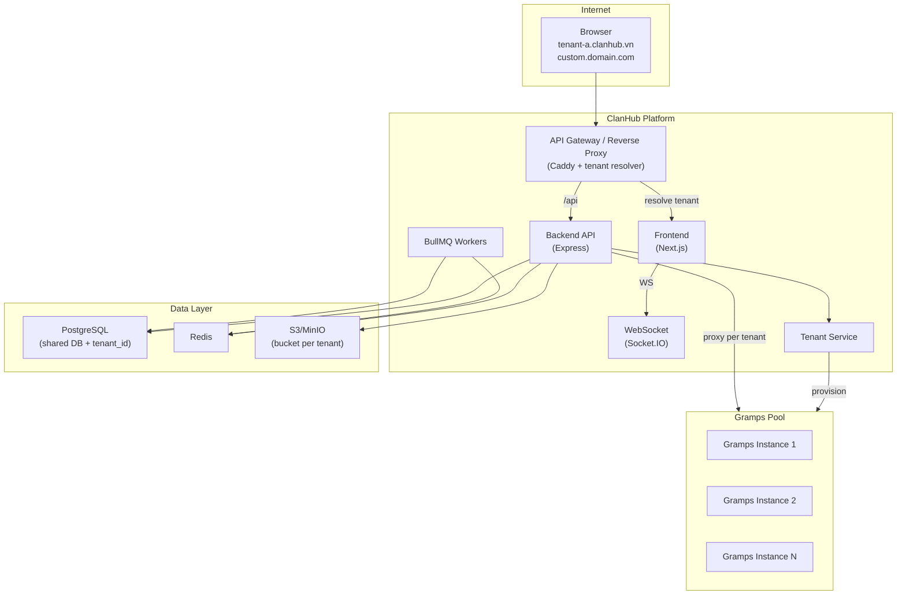
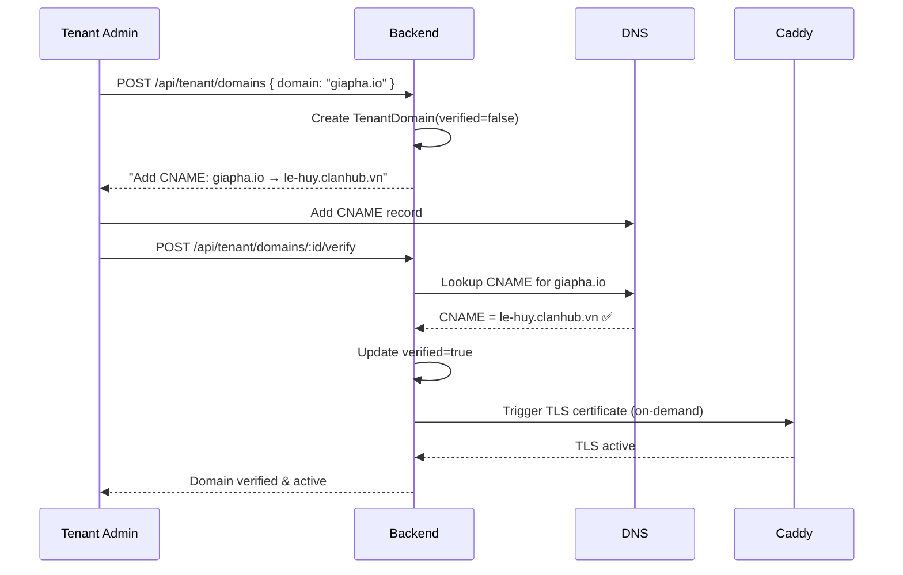
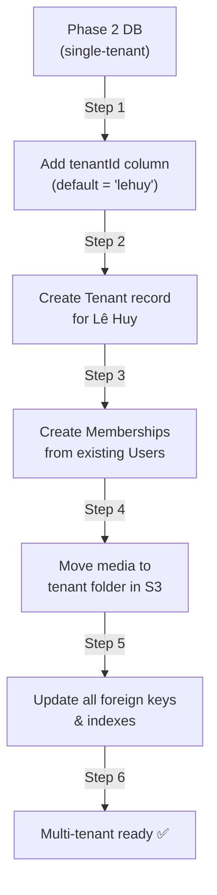
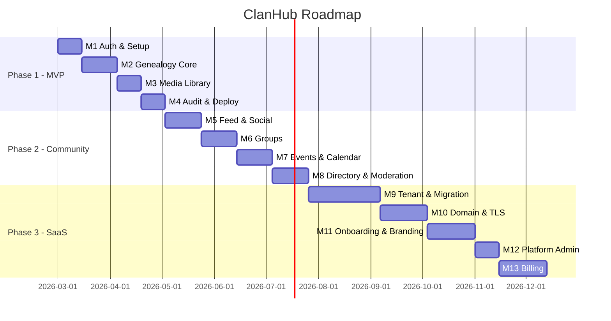

# PlanPhase3 — Kiến trúc FE & BE cho ClanHub (Giai đoạn 3: SaaS Đa Dòng Họ)

**Phiên bản:** v1.0  
**Ngày:** 2026-02-19  
**Tham chiếu:** `prd (1).md` — Giai đoạn 3 "SaaS đa dòng họ"  
**Kế thừa từ:** `PlanPhase1.md` + `PlanPhase2.md`

---

## 1. Tổng quan mục tiêu Phase 3

Nâng cấp ClanHub thành **SaaS đa dòng họ** — mỗi dòng họ là 1 tenant riêng biệt:

- **Multi-tenant architecture**: data isolation, media isolation
- **Tenant management**: tạo tenant, branding, quota
- **Custom domain**: subdomain mặc định + domain riêng (DNS verify, auto TLS)
- **Billing/Plans** (optional): Free / Standard / Pro
- **Platform Admin Console**: quản lý toàn bộ tenants
- **Migrator**: chuyển dữ liệu single-tenant (Phase 1/2) sang tenant structure

### Kế thừa từ Phase 1 + 2

| Module | Trạng thái Phase 3 |
|---|---|
| Auth & RBAC | ✅ Mở rộng: global account (1 user nhiều tenant), Membership model |
| Genealogy Core | ✅ Giữ nguyên + tenant-scoped Gramps instance |
| Community Layer | ✅ Giữ nguyên + tenant isolation |
| Media Library | ✅ Bucket/folder per tenant + signed URL scoped |
| Background Jobs | ✅ Giữ nguyên + tenant-aware queues |
| Notifications | ✅ Giữ nguyên + tenant context |

---

## 2. Kiến trúc tổng quan



### Chiến lược Tenant Isolation

| Concern | Quyết định | Lý do |
|---|---|---|
| **Database** | Shared DB + `tenantId` column | Tối ưu cost, dễ vận hành, đủ isolation cho quy mô này |
| **Media** | Folder per tenant trong MinIO/S3 (`/{tenantId}/...`) | Dễ quản lý quota, backup riêng |
| **Gramps** | Pool Gramps instances hoặc 1 instance per tenant (config) | Tách genealogy data hoàn toàn |
| **Redis** | Key prefix `tenant:{id}:` | Namespace isolation |

---

## 3. Bổ sung Tech Stack

| Thành phần | Công nghệ | Lý do |
|---|---|---|
| Tenant Resolver | **Caddy** + custom middleware | Resolve domain/subdomain → tenantId |
| DNS Verification | **DNS lookup** (Node.js `dns` module) | Verify CNAME/TXT records |
| TLS Auto | **Caddy** on-demand TLS | Auto issue cert cho custom domain |
| Billing | **Stripe** (optional) | Payment processing, subscriptions |
| Admin Console | Next.js `/platform-admin/*` routes | Platform-wide management |

---

## 4. Database Schema mở rộng

### 4.1 Tenant models

```prisma
model Tenant {
  id          String       @id @default(cuid())
  slug        String       @unique  // "le-huy" → le-huy.clanhub.vn
  name        String                // "Dòng họ Lê Huy"
  plan        TenantPlan   @default(FREE)
  status      TenantStatus @default(ACTIVE)
  grampsUrl   String?              // URL to tenant's Gramps instance
  createdAt   DateTime     @default(now())
  updatedAt   DateTime     @updatedAt

  domains     TenantDomain[]
  branding    TenantBranding?
  memberships Membership[]
  quota       TenantQuota?
}

enum TenantPlan {
  FREE
  STANDARD
  PRO
}

enum TenantStatus {
  ACTIVE
  SUSPENDED
  PENDING_SETUP
}

model TenantDomain {
  id         String  @id @default(cuid())
  tenantId   String
  tenant     Tenant  @relation(fields: [tenantId], references: [id])
  domain     String  @unique    // "giapha-lehuy.com"
  type       String  @default("SUBDOMAIN") // SUBDOMAIN, CUSTOM
  verified   Boolean @default(false)
  tlsStatus  String  @default("PENDING") // ACTIVE, PENDING, ERROR
  verifiedAt DateTime?
  createdAt  DateTime @default(now())
}

model TenantBranding {
  id           String  @id @default(cuid())
  tenantId     String  @unique
  tenant       Tenant  @relation(fields: [tenantId], references: [id])
  logoKey      String? // S3 key for logo
  faviconKey   String?
  primaryColor String  @default("#8B4513")
  accentColor  String  @default("#D4A574")
  landingHtml  String? // Custom landing page HTML
  updatedAt    DateTime @updatedAt
}

model TenantQuota {
  id            String @id @default(cuid())
  tenantId      String @unique
  tenant        Tenant @relation(fields: [tenantId], references: [id])
  maxUsers      Int    @default(50)
  maxStorageMB  Int    @default(1024) // 1 GB
  currentUsers  Int    @default(0)
  currentStorageMB Int @default(0)
  features      Json   // { "customDomain": true, "sso": false }
}

model Membership {
  id       String @id @default(cuid())
  tenantId String
  tenant   Tenant @relation(fields: [tenantId], references: [id])
  userId   String
  user     User   @relation(fields: [userId], references: [id])
  role     Role   @default(MEMBER)
  joinedAt DateTime @default(now())
  @@unique([tenantId, userId])
}
```

### 4.2 Billing models (optional)

```prisma
model Subscription {
  id               String   @id @default(cuid())
  tenantId         String   @unique
  stripeCustomerId String?
  stripeSubId      String?
  plan             TenantPlan
  status           String   // "active", "past_due", "canceled"
  currentPeriodEnd DateTime?
  createdAt        DateTime @default(now())
}

model Invoice {
  id        String   @id @default(cuid())
  tenantId  String
  amount    Int      // cents
  currency  String   @default("VND")
  status    String   // "paid", "pending", "failed"
  stripeInvoiceId String?
  paidAt    DateTime?
  createdAt DateTime @default(now())
}
```

### 4.3 Thêm `tenantId` vào tất cả entity

```prisma
// MỌI model hiện có đều thêm:
model Post {
  // ... existing fields ...
  tenantId String
  @@index([tenantId])
}

model Group {
  tenantId String
  @@index([tenantId])
}

model Event {
  tenantId String
  @@index([tenantId])
}

model Media {
  tenantId String
  @@index([tenantId])
}

model AuditLog {
  tenantId String
  @@index([tenantId])
}

// v.v. cho tất cả models
```

> **Migration strategy**: Prisma migration thêm `tenantId` với default value là ID của tenant Lê Huy (Phase 1 data), sau đó set `NOT NULL`.

---

## 5. Tenant Resolution & Routing

### 5.1 Domain → Tenant Resolver

```typescript
// middleware/tenant-resolver.ts
async function resolveTenant(req: Request): Promise<string> {
  const host = req.hostname; // e.g. "le-huy.clanhub.vn" or "giapha-lehuy.com"
  
  // 1. Check subdomain
  const subdomain = extractSubdomain(host, "clanhub.vn");
  if (subdomain) {
    const tenant = await findTenantBySlug(subdomain);
    if (tenant) return tenant.id;
  }
  
  // 2. Check custom domain
  const domain = await findTenantDomain(host);
  if (domain?.verified) return domain.tenantId;
  
  throw new TenantNotFoundError(host);
}

// Attach to every request
app.use(async (req, res, next) => {
  req.tenantId = await resolveTenant(req);
  next();
});
```

### 5.2 Caddy Configuration

```caddyfile
# Default subdomains
*.clanhub.vn {
  reverse_proxy /api/* backend:4000
  reverse_proxy /* frontend:3000
}

# Custom domains (on-demand TLS)
:443 {
  tls {
    on_demand
  }
  reverse_proxy /api/* backend:4000
  reverse_proxy /* frontend:3000
}
```

### 5.3 Custom Domain Flow



---

## 6. API Endpoints mới

### Tenant (`/api/tenant`)

| Method | Path | Mô tả | Role |
|---|---|---|---|
| GET | `/` | Thông tin tenant hiện tại | Auth |
| PATCH | `/` | Cập nhật tenant info | Tenant Admin |
| GET | `/branding` | Lấy branding config | Public |
| PATCH | `/branding` | Cập nhật branding | Tenant Admin |
| GET | `/quota` | Xem quota usage | Tenant Admin |
| GET | `/domains` | Danh sách domains | Tenant Admin |
| POST | `/domains` | Thêm custom domain | Tenant Admin |
| POST | `/domains/:id/verify` | Verify DNS | Tenant Admin |
| DELETE | `/domains/:id` | Xóa domain | Tenant Admin |
| GET | `/members` | Danh sách memberships | Tenant Admin |

### Platform Admin (`/api/platform`) — chỉ Platform Super Admin

| Method | Path | Mô tả |
|---|---|---|
| GET | `/tenants` | Danh sách tất cả tenants |
| POST | `/tenants` | Tạo tenant mới |
| PATCH | `/tenants/:id` | Cập nhật tenant (plan, status) |
| PATCH | `/tenants/:id/suspend` | Suspend tenant |
| PATCH | `/tenants/:id/restore` | Restore tenant |
| GET | `/tenants/:id/usage` | Storage/user usage |
| POST | `/tenants/:id/backup` | Trigger backup cho tenant |
| GET | `/stats` | Platform-wide statistics |
| GET | `/health` | System health check |

### Account (`/api/account`) — global account

| Method | Path | Mô tả |
|---|---|---|
| GET | `/tenants` | Danh sách tenants user thuộc |
| POST | `/switch-tenant` | Switch active tenant |

### Billing (`/api/billing`) — optional

| Method | Path | Mô tả |
|---|---|---|
| GET | `/subscription` | Current subscription |
| POST | `/checkout` | Create Stripe checkout |
| POST | `/webhook` | Stripe webhook |
| GET | `/invoices` | Payment history |

---

## 7. Frontend — Pages mới

### 7.1 Cấu trúc mở rộng

```
frontend/src/app/
├── (auth)/              # Phase 1 ✅ (mở rộng: tenant context)
├── (main)/              # Phase 1+2 ✅ (scoped per tenant)
│
│ ── 🆕 Phase 3 pages ──
├── (tenant-setup)/
│   └── setup/page.tsx           # Onboarding wizard cho tenant mới
├── tenant-settings/
│   ├── general/page.tsx         # Tên, mô tả tenant
│   ├── branding/page.tsx        # Logo, colors, landing
│   ├── domains/page.tsx         # Manage domains
│   ├── quota/page.tsx           # View quota usage
│   ├── members/page.tsx         # Manage memberships
│   └── billing/page.tsx         # Subscription & invoices
├── select-tenant/page.tsx       # Tenant switcher
│
│ ── Platform Admin (route group riêng) ──
├── (platform-admin)/
│   ├── layout.tsx
│   ├── tenants/
│   │   ├── page.tsx             # Tenant list
│   │   └── [id]/page.tsx        # Tenant detail
│   ├── stats/page.tsx           # Platform stats
│   └── health/page.tsx          # System health
```

### 7.2 Mô tả trang

- **Tenant Switcher** (`/select-tenant`): user chọn tenant nếu thuộc nhiều dòng họ
- **Tenant Setup** (`/setup`): wizard tạo tenant mới (tên, slug, branding cơ bản)
- **Tenant Settings**: quản lý tenant — logo/colors, domains, quota, memberships
- **Platform Admin**: super admin quản lý toàn bộ tenants, stats, health

### 7.3 Tenant-aware Components mới

```
components/
├── tenant/
│   ├── TenantSwitcher.tsx       # Dropdown chọn tenant
│   ├── TenantBrandingProvider.tsx # Apply branding (colors, logo)
│   ├── DomainManager.tsx        # Add/verify/remove domains
│   ├── QuotaUsageCard.tsx       # Storage & user usage bars
│   └── SetupWizard.tsx          # Multi-step onboarding
├── platform/
│   ├── TenantTable.tsx          # Admin tenant list
│   ├── TenantDetailPanel.tsx
│   └── PlatformStatsCards.tsx
```

---

## 8. Middleware Pipeline (Phase 3)

```
Request
  → Rate Limiter
  → CORS
  → Body Parser
  → 🆕 Tenant Resolver (domain → tenantId)
  → Auth Middleware (JWT → user)
  → 🆕 Membership Check (user belongs to tenant?)
  → 🆕 Quota Check (storage/user limits)
  → RBAC Guard
  → Privacy Filter
  → Controller → Service (all queries scoped by tenantId)
  → Error Handler
  → Audit Logger (with tenantId)
```

### Scoped Queries

```typescript
// Prisma middleware hoặc base service
class TenantScopedService {
  constructor(private tenantId: string) {}
  
  findPosts(filters: PostFilters) {
    return prisma.post.findMany({
      where: { tenantId: this.tenantId, ...filters }
    });
  }
  // Mọi query tự động scope theo tenant
}
```

---

## 9. Data Migration (Single → Multi-tenant)

### 9.1 Migration Strategy



### 9.2 Migration Script

```typescript
async function migrateSingleToMultiTenant() {
  // 1. Create default tenant
  const tenant = await prisma.tenant.create({
    data: { slug: "le-huy", name: "Dòng họ Lê Huy", plan: "STANDARD" }
  });
  
  // 2. Add tenantId to all existing records
  await prisma.$executeRaw`UPDATE "Post" SET "tenantId" = ${tenant.id}`;
  await prisma.$executeRaw`UPDATE "Group" SET "tenantId" = ${tenant.id}`;
  // ... repeat for all tables
  
  // 3. Create memberships from existing users
  const users = await prisma.user.findMany();
  for (const user of users) {
    await prisma.membership.create({
      data: { tenantId: tenant.id, userId: user.id, role: user.role }
    });
  }
  
  // 4. Move S3 media to tenant folder
  await moveS3Objects("media/", `${tenant.id}/media/`);
  
  // 5. Create default subdomain
  await prisma.tenantDomain.create({
    data: { tenantId: tenant.id, domain: "le-huy.clanhub.vn", type: "SUBDOMAIN", verified: true }
  });
}
```

---

## 10. Milestones Phase 3

| Milestone | Nội dung | Thời gian |
|---|---|---|
| **M9** | Tenant model + isolation + migration script | 3–6 tuần |
| **M10** | Domain routing + custom domain + TLS | 2–4 tuần |
| **M11** | Self-serve onboarding + branding + quota | 2–4 tuần |
| **M12** | Platform Admin + backup per tenant | 1–2 tuần |
| **M13** | Billing + plans (optional) | 2–4 tuần |
| **Tổng** | | **10–20 tuần** |

### Chi tiết

- **M9**: Prisma migration (tenantId), Tenant/Membership/Quota models, tenant resolver middleware, migration script Phase 2→3, scoped queries
- **M10**: Caddy on-demand TLS, domain management API, DNS verification, tenant-aware routing
- **M11**: Tenant setup wizard, branding (logo/colors/landing), quota enforcement, tenant switcher
- **M12**: Platform admin pages (tenant list, stats, suspend/restore, backup per tenant), health endpoint
- **M13**: Stripe integration, subscription management, checkout flow, webhook handlers, invoice history

---

## 11. Verification Plan

### Automated Tests
- Tenant isolation: data from tenant A not visible in tenant B
- Domain resolver: subdomain + custom domain → correct tenant
- Quota enforcement: reject when limit reached
- Migration script: single-tenant data correctly assigned tenantId
- Membership: user access only in joined tenants

### Manual Verification
- Tạo 3 tenants → mỗi tenant thấy riêng dữ liệu
- Custom domain: add → DNS verify → TLS hoạt động
- Tenant switch: 1 user thuộc 2 tenant → switch thành công
- Suspend tenant → users không truy cập được → restore
- Branding: đổi logo/color → phản ánh đúng trên site

---

## 12. Rủi ro Phase 3

| Rủi ro | Mức độ | Giảm thiểu |
|---|---|---|
| Data leakage giữa tenants | Cao | Prisma middleware scope, integration tests |
| Migration downtime | Trung bình | Backward-compatible migration, blue-green deploy |
| Custom domain DNS delay | Thấp | Async verification, retry mechanism |
| Gramps instance provisioning | Trung bình | Container pool, lazy init |
| Billing complexity | Thấp | Start simple (1 plan), iterate |
| Cost scaling | Trung bình | Quota enforcement, lifecycle policies |

---

## 13. Tổng kết 3 Phases


