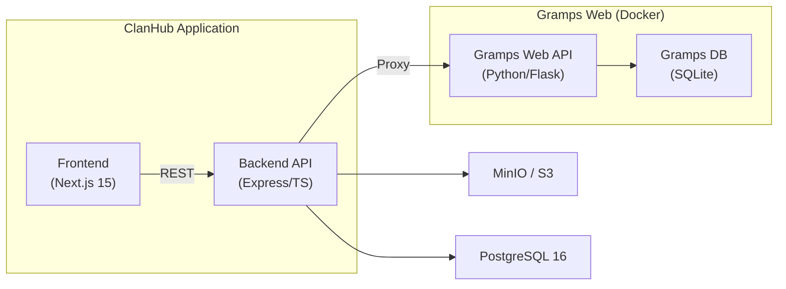
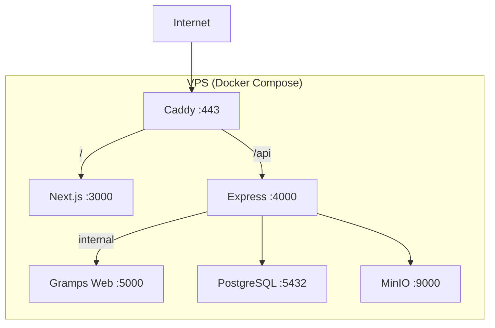

# Architecture Decision Document — ClanHub Phase 1

## 1. System Context & Goals

ClanHub (GiaPhaHub) là nền tảng gia phả trực tuyến cho **dòng họ Lê Huy** (single-tenant MVP).

### Mục tiêu Phase 1
- Đăng nhập / phân quyền (RBAC) / mời thành viên
- Xem & duyệt cây gia phả (tree browse, person profile, family view)
- Bảo vệ quyền riêng tư người còn sống (Living Privacy)
- Thư viện tư liệu (Media Library) + quy trình duyệt
- Audit log cho mọi thao tác chỉnh sửa
- Backup & export dữ liệu (GEDCOM + DB)

### Integration Strategy
**Decision:** Giữ Gramps Web như một Genealogy Service độc lập (Option 2 — PRD).
ClanHub gọi vào Gramps Web REST API thông qua proxy layer.

**Rationale:**
- Không fork → dễ cập nhật upstream Gramps Web
- Tách rõ domain: genealogy core vs. ClanHub business logic
- Dễ mở rộng sang Phase 2 (community) và Phase 3 (multi-tenant)



---

## 2. Technology Decisions

### 2.1 Frontend Stack

| Decision | Choice | Alternatives Considered | Rationale |
|---|---|---|---|
| Framework | **Next.js 15** (App Router) | Vite + React, Remix | SSR/SSG, routing, SEO, React ecosystem |
| Language | **TypeScript** | JavaScript | Type safety, DX, shared types with BE |
| UI Components | **shadcn/ui** + Radix UI | MUI, Ant Design | Accessible, fully customizable, owns the code |
| Styling | **Tailwind CSS v4** | CSS Modules, Styled Components | Utility-first, design tokens, co-location |
| State | **Zustand** | Redux, Jotai | Lightweight, minimal boilerplate for Phase 1 |
| Data Fetching | **TanStack Query** | SWR, RTK Query | Caching, invalidation, optimistic updates |
| Tree Visualization | **D3.js** hoặc React Flow | GoJS, Cytoscape | Interactive, community support |
| Forms | **React Hook Form + Zod** | Formik | Performance, shared validation schemas |
| Auth Client | **NextAuth.js v5** | Custom | JWT session, middleware protection |

### 2.2 Backend Stack

| Decision | Choice | Alternatives Considered | Rationale |
|---|---|---|---|
| Runtime | **Node.js 20 LTS** | Deno, Bun | Ecosystem maturity, JS team unified FE/BE |
| Framework | **Express.js** | Fastify, NestJS | Lightweight, flexible, vast middleware |
| Language | **TypeScript** | — | Shared types with FE |
| ORM | **Prisma** | TypeORM, Drizzle | Type-safe, migration, introspection |
| Database | **PostgreSQL 16** | MySQL, MongoDB | Reliable, JSON support, full-text search |
| Auth | **JWT** (access 15min + refresh 7d) | Session-based | Stateless, API-friendly |
| Password | **argon2** | bcrypt | Stronger, configurable |
| File Upload | **Multer + S3 SDK** | Formidable | Stream to S3/MinIO |
| Storage | **MinIO** (dev) / S3 (prod) | Cloudflare R2 | S3-compatible, self-hosted |
| Email | **Nodemailer + Resend** | SendGrid | Invite links, password reset |
| Validation | **Zod** | Joi, Yup | Share schemas FE ↔ BE |
| Logging | **Pino** | Winston | Structured JSON, performance |
| API Docs | **Swagger / OpenAPI** | — | Auto-gen from JSDoc |

### 2.3 Infrastructure

| Decision | Choice | Rationale |
|---|---|---|
| Containers | **Docker + Docker Compose** | Reproducible, multi-service orchestration |
| Gramps Web | **Official Docker Image** | No fork needed |
| Reverse Proxy | **Caddy** | Auto TLS, simple config |
| CI/CD | **GitHub Actions** | Free for OSS, integrated |
| Hosting | **VPS** (Hetzner/DigitalOcean) | Cost-effective for single-tenant |
| Monitoring | **UptimeRobot + Pino logs** | Simple for MVP |

---

## 3. Data Model

### 3.1 Prisma Schema — Core Entities

```prisma
// === IDENTITY & ACCESS ===
model User {
  id            String     @id @default(cuid())
  email         String     @unique
  passwordHash  String
  displayName   String
  role          Role       @default(MEMBER)
  status        UserStatus @default(ACTIVE)
  avatarUrl     String?
  phone         String?
  invitedBy     String?
  createdAt     DateTime   @default(now())
  updatedAt     DateTime   @updatedAt
  media         Media[]
  auditLogs     AuditLog[] @relation("actor")
  refreshTokens RefreshToken[]
}

model RefreshToken {
  id        String   @id @default(cuid())
  token     String   @unique
  userId    String
  user      User     @relation(fields: [userId], references: [id], onDelete: Cascade)
  expiresAt DateTime
  createdAt DateTime @default(now())
}

model InviteLink {
  id        String    @id @default(cuid())
  code      String    @unique
  role      Role      @default(MEMBER)
  maxUses   Int       @default(1)
  usedCount Int       @default(0)
  expiresAt DateTime?
  createdBy String
  createdAt DateTime  @default(now())
}

enum Role { ADMIN  EDITOR  ARCHIVIST  MEMBER  GUEST }
enum UserStatus { ACTIVE  SUSPENDED  PENDING }

// === MEDIA & ARCHIVE ===
model Media {
  id             String     @id @default(cuid())
  fileKey        String
  fileName       String
  mimeType       String
  fileSize       Int
  title          String?
  description    String?
  date           DateTime?
  linkedPersonId String?
  linkedEventType String?
  state          MediaState @default(PENDING)
  uploaderId     String
  uploader       User       @relation(fields: [uploaderId], references: [id])
  reviewedBy     String?
  reviewedAt     DateTime?
  createdAt      DateTime   @default(now())
  updatedAt      DateTime   @updatedAt
}

enum MediaState { PENDING  PUBLISHED  REJECTED }

// === AUDIT LOG ===
model AuditLog {
  id          String   @id @default(cuid())
  actorId     String
  actor       User     @relation("actor", fields: [actorId], references: [id])
  action      String
  entityType  String
  entityId    String?
  diffSummary Json?
  ipAddress   String?
  createdAt   DateTime @default(now())
}

// === PRIVACY CONFIG ===
model PrivacyConfig {
  id                String   @id @default(cuid())
  hideLivingDetails Boolean  @default(true)
  memberCanSee      Json     // ["name", "birthYear"]
  editorCanSee      Json     // ["name", "birthYear", "birthDate", "phone"]
  adminCanSee       Json     // ["*"]
  updatedAt         DateTime @updatedAt
}

// === BACKUP ===
model BackupRecord {
  id        String   @id @default(cuid())
  type      String   // GEDCOM, DB_SNAPSHOT
  fileKey   String
  fileSize  Int
  createdBy String
  createdAt DateTime @default(now())
}
```

---

## 4. API Design

### 4.1 Conventions
- RESTful, prefix `/api`
- Response: `{ success: boolean, data?: T, error?: { code, message } }`
- Pagination: `?page=1&limit=20` → `{ data, meta: { total, page, limit, totalPages } }`
- Date: ISO 8601
- Conventional HTTP status codes + custom business error codes

### 4.2 Endpoint Inventory

| Module | Method | Path | Role |
|---|---|---|---|
| **Auth** | POST | `/api/auth/register` | Public |
| | POST | `/api/auth/login` | Public |
| | POST | `/api/auth/refresh` | Auth |
| | POST | `/api/auth/logout` | Auth |
| | POST | `/api/auth/forgot-password` | Public |
| | POST | `/api/auth/reset-password` | Public |
| **Users** | GET | `/api/users` | Admin |
| | GET | `/api/users/me` | Auth |
| | PATCH | `/api/users/me` | Auth |
| | PATCH | `/api/users/:id/role` | Admin |
| | PATCH | `/api/users/:id/status` | Admin |
| | POST | `/api/users/invite` | Admin |
| | GET | `/api/users/invite` | Admin |
| **Genealogy** | GET | `/api/genealogy/people` | Member+ |
| | GET | `/api/genealogy/people/:handle` | Member+ |
| | GET | `/api/genealogy/families` | Member+ |
| | GET | `/api/genealogy/families/:handle` | Member+ |
| | GET | `/api/genealogy/tree` | Member+ |
| | PUT | `/api/genealogy/people/:handle` | Editor+ |
| | POST | `/api/genealogy/people` | Editor+ |
| | POST | `/api/genealogy/families` | Editor+ |
| | DELETE | `/api/genealogy/people/:handle` | Admin |
| **Media** | POST | `/api/media/upload` | Member+ |
| | GET | `/api/media` | Member+ |
| | GET | `/api/media/:id` | Member+ |
| | PATCH | `/api/media/:id/approve` | Archivist+ |
| | PATCH | `/api/media/:id/reject` | Archivist+ |
| | DELETE | `/api/media/:id` | Admin |
| **Audit** | GET | `/api/audit` | Admin, Editor |
| | GET | `/api/audit/entity/:type/:id` | Admin, Editor |
| **Backup** | POST | `/api/backup/export/gedcom` | Admin |
| | POST | `/api/backup/snapshot` | Admin |
| | GET | `/api/backup` | Admin |
| | GET | `/api/backup/:id/download` | Admin |

---

## 5. Key Architectural Patterns

### 5.1 Middleware Pipeline

```
Request → Rate Limiter → CORS → Body Parser
  → Auth Middleware (verify JWT → attach user)
  → RBAC Guard (check role vs. required)
  → Privacy Filter (filter living person data by role)
  → Controller → Service → Response
  → Error Handler (centralized)
  → Audit Logger (async, post-response)
```

### 5.2 Genealogy Proxy — Privacy Filter

```typescript
function filterPerson(person: GrampsPerson, userRole: Role): FilteredPerson {
  const isLiving = person.death === null && !person.deceased;
  if (!isLiving) return person;

  const config = await getPrivacyConfig();
  const allowedFields = config[`${userRole}CanSee`];
  if (allowedFields.includes("*")) return person;

  return {
    ...pickFields(person, allowedFields),
    _privacyNote: "Thông tin bị ẩn do chính sách bảo mật người còn sống"
  };
}
```

### 5.3 Module Architecture

```
backend/src/modules/
├── auth/       # controller, service, routes, dto
├── user/       # controller, service, routes, dto
├── genealogy/  # proxy → Gramps Web API
├── media/      # upload, approve, list, tag
├── audit/      # log service, query
└── backup/     # export GEDCOM, DB snapshot
```

Each module follows: `routes.ts` → `controller.ts` → `service.ts` → `dto.ts`

---

## 6. Security Decisions

| Concern | Decision |
|---|---|
| Authentication | JWT (15min access + 7d refresh), httpOnly cookie for refresh |
| Authorization | RBAC middleware: `user.role` vs. endpoint requirement |
| Privacy | Server-side mandatory filter for living persons |
| Rate Limiting | 100 req/min general, 5 req/min for login |
| Input Validation | Zod schemas shared between FE and BE |
| CORS | Whitelist FE origin only |
| Password | argon2 hash, min 8 chars |
| File Upload | 10MB limit, allow jpg/png/pdf only |
| Media Access | Pre-signed S3 URLs (1h expiry) |
| Audit | Async log all mutation actions |
| TLS | Caddy auto-TLS |

---

## 7. Deployment Architecture



**Docker Compose services:** frontend, backend, grampsweb, postgres, minio, caddy

---

## 8. Frontend Architecture

### 8.1 Route Structure
```
app/
├── (auth)/         # Login, Register, Forgot Password
├── (main)/         # Sidebar + Header layout
│   ├── page.tsx    # Dashboard
│   ├── tree/       # Family tree (D3.js)
│   ├── people/     # People list + [handle] profile
│   ├── media/      # Media library + [id] detail
│   └── admin/      # Users, Audit, Backup
└── api/            # NextAuth routes
```

### 8.2 Design System
- Theme: Dark/Light mode toggle
- Layout: Collapsible sidebar + Header + Content
- Typography: Inter (Google Fonts)
- Colors: Warm earth tones — Primary `#8B4513`, Accent `#D4A574`, Neutral Slate
- Mobile-first responsive
- Framer Motion for transitions

---

## 9. Risks & Mitigations

| Risk | Severity | Mitigation |
|---|---|---|
| Gramps Web API version changes | Medium | Pin Docker image version, proxy layer isolates |
| Tree view performance | Low (Phase 1 small) | Pagination, lazy load, virtual canvas |
| Media storage cost | Low | Self-hosted MinIO, file size limit |
| Privacy leak | **High** | Server-side mandatory filter, FE is display-only |
| Single point of failure | Medium | Docker health checks, daily backup |

---

## 10. Project Structure

```
clanhub/
├── frontend/       # Next.js 15 + TypeScript
├── backend/        # Express + TypeScript + Prisma
├── docker/         # Docker Compose configs
├── docs/           # Project documentation
├── _bmad/          # BMAD method files
└── _bmad-output/   # BMAD artifacts
```

### Git & Code Conventions
- Monorepo structure
- Branch: `main` → `develop` → `feature/xxx`
- Commit: Conventional Commits
- Lint: ESLint + Prettier (shared config)
